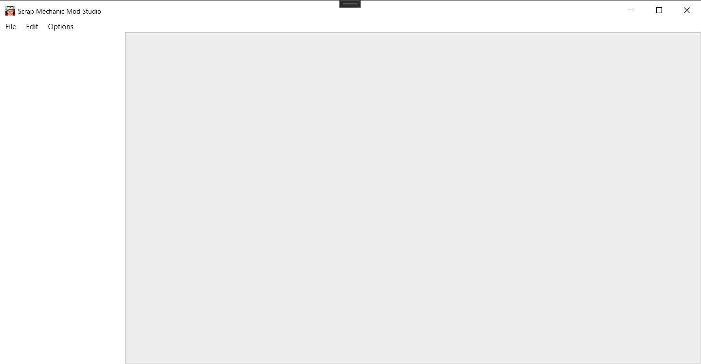
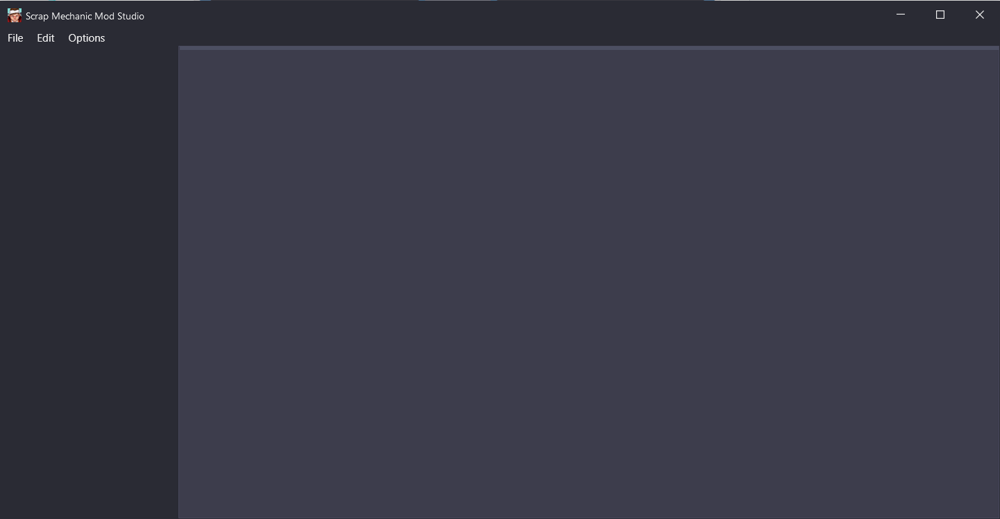
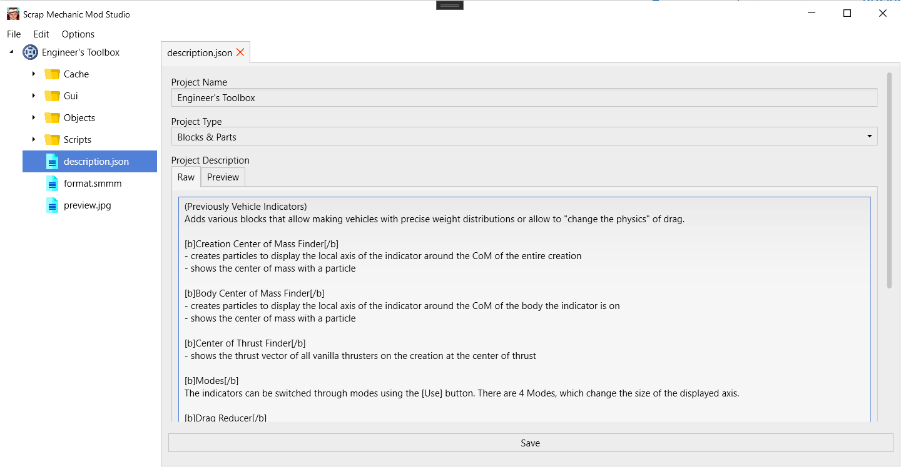
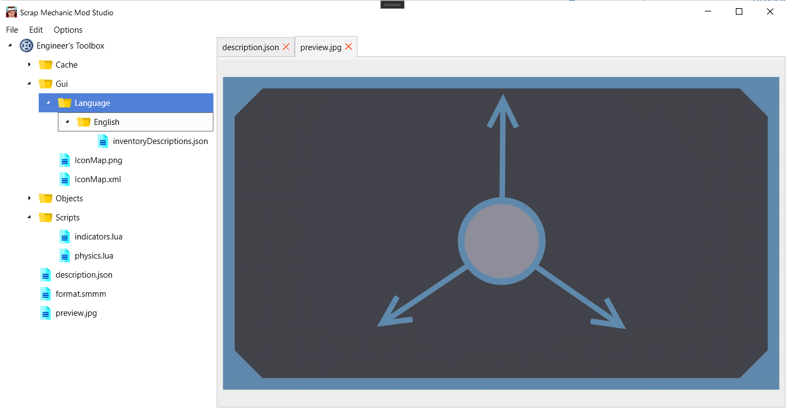
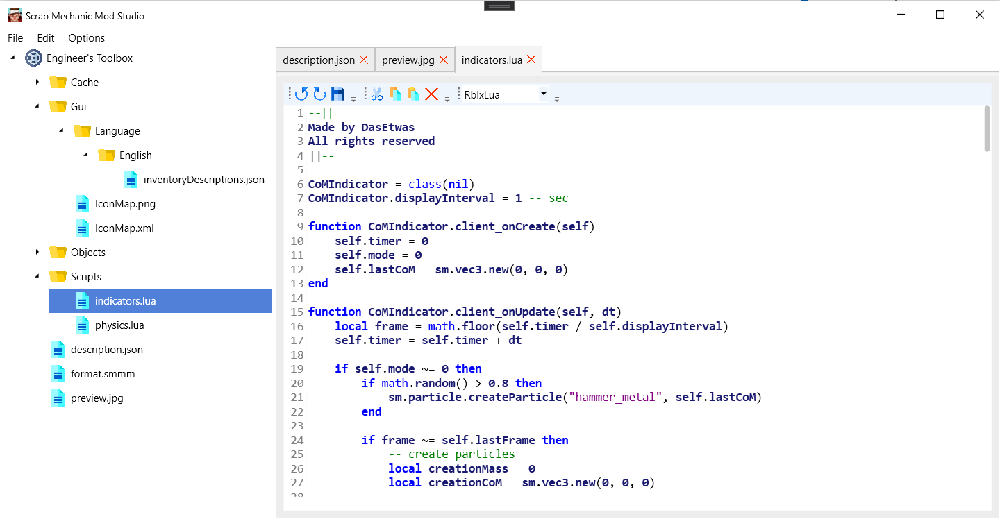
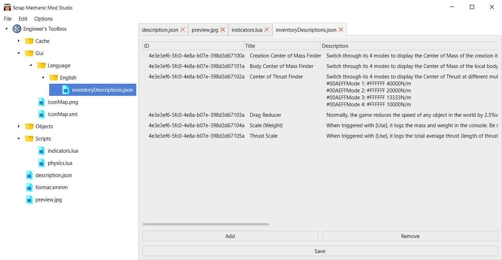

<h1 align="center">
     
        
     
        Scrap Mechanic Mod Studio
     
</h1>

## Features (w/ Todo)

- [X] Code Editor
    - [ ] Intellisense
    - [X] Syntax Highlighting
- [ ] Language Editor
    - [ ] Built-In Translator (w/ DeepL Translator)
- [X] Clean & Fluent Design
- [X] Multi-Language Support
    - [X] Chinese (zh-CN)
- [X] Easy Project Mangement

## Screenshots

